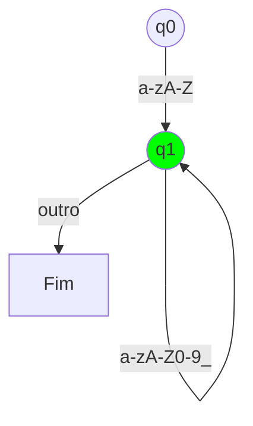
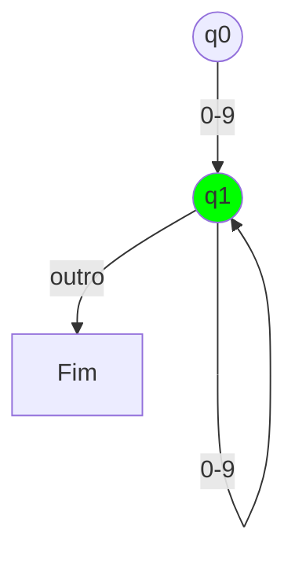
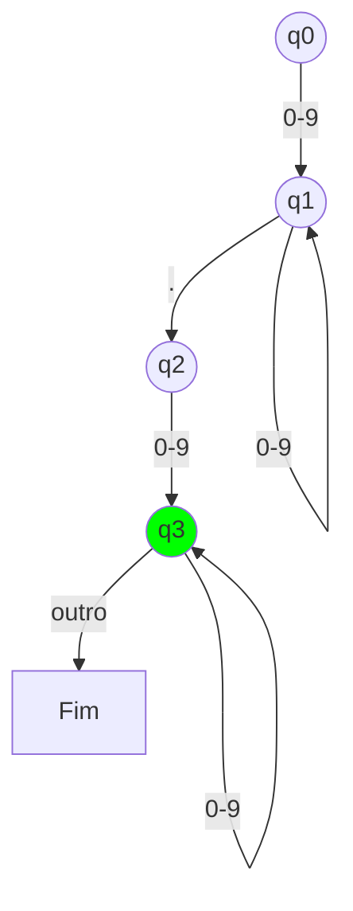
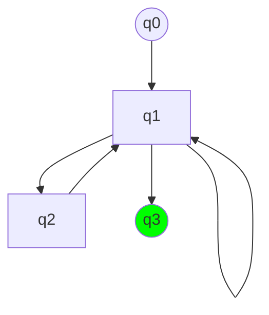
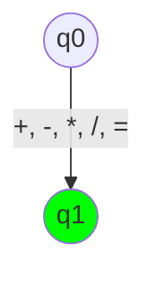
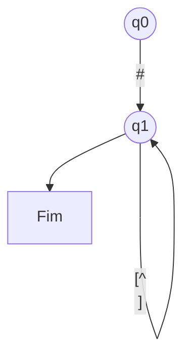
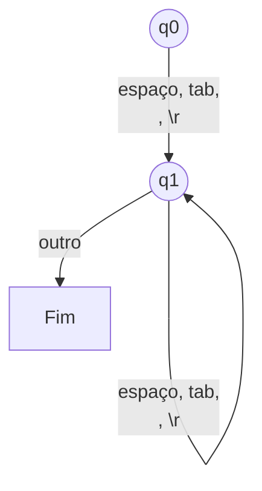

# AFDs SimplesCOde

Este documento contém os diagramas de Autômatos Finitos Determinísticos (AFDs) para os tokens da linguagem SimplesCode, baseados nas expressões regulares definidas na Semana 4. Cada AFD é representado usando a sintaxe Mermaid para visualização.
Diagramas dos AFDs
A minimização de AFDs será aplicada para otimizar o desempenho do analisador léxico.

## AFD para Identificadores (ID)

Regex: [a-zA-Z][a-zA-Z0-9_]*

## AFD para Números Inteiros (INT)

Regex: [0-9]+

## AFD para Números Decimais (DECIMAL)

Regex: [0-9]+\.[0-9]+

## AFD para Strings (STR)

Regex: "([^"\\]|\\.)*"

## AFD para Operadores

Regex: \+|\-|\*|\/|=

## AFD para Comentários

Regex: \#.*

## AFD para Espaços em Branco

Regex: [ \t\n\r]+

