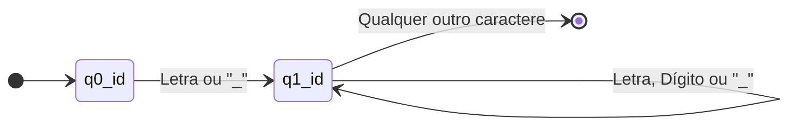
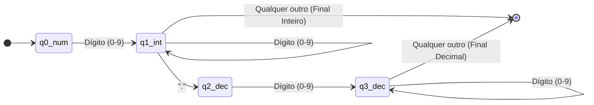
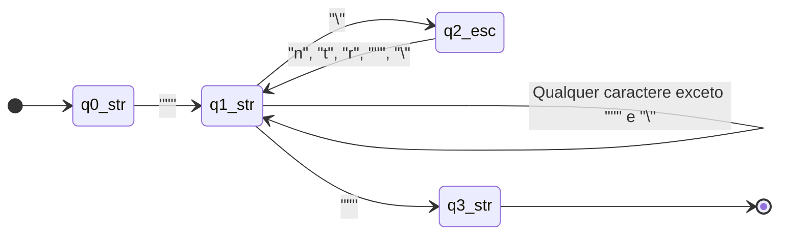
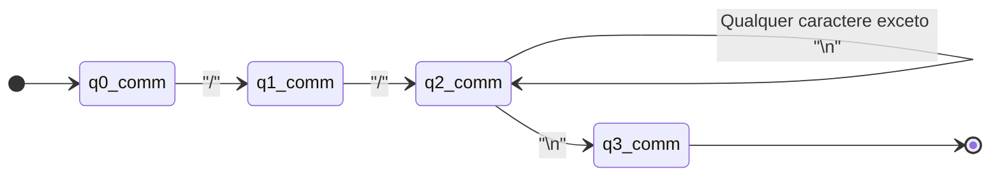
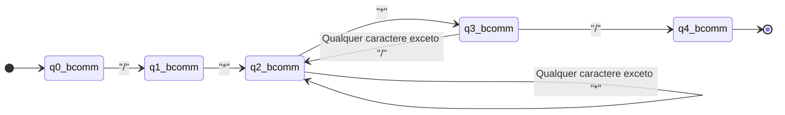
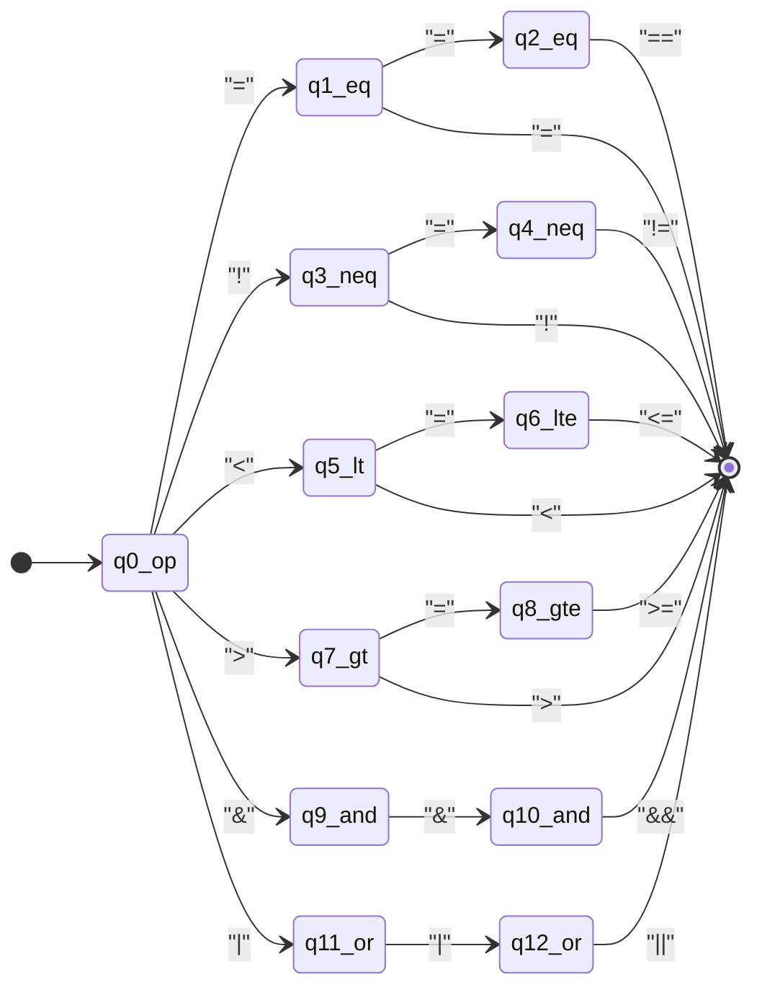
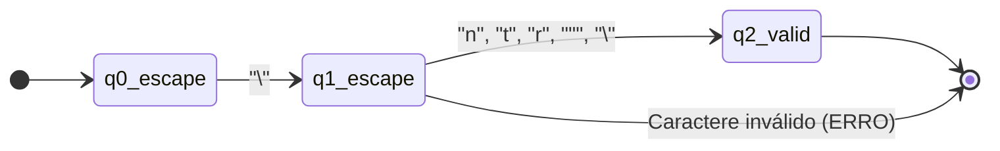
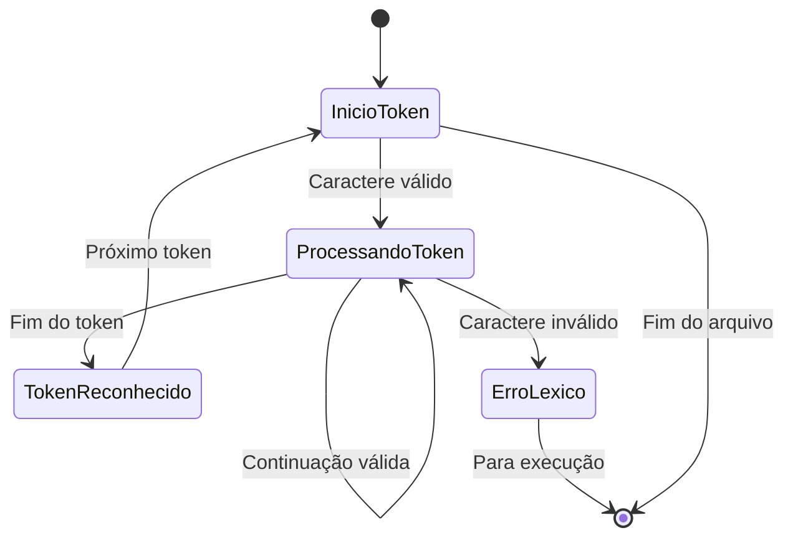

# AFDs Finais

1. AFD para Identificadores e Palavras-Chave

2. AFD para Números (Inteiros e Decimais)

3. AFD para Strings

4. AFD para Comentários de Linha

5. AFD para Comentários de Bloco

6. AFD para Operadores Compostos

7. AFD Completo - Visão Geral dos Tokens

```mermaid
stateDiagram-v2
    direction LR
    [*] --> Inicio
    
    state Inicio {
        [*] --> Classificar
        Classificar --> Identificador : Letra ou "_"
        Classificar --> Numero : Dígito (0-9)
        Classificar --> String : "\""
        Classificar --> Comentario : "/"
        Classificar --> Operador : "+-*/%=!<>&|"
        Classificar --> Delimitador : "(){}[],;:."
        
        Identificador --> [*]
        Numero --> [*]
        String --> [*]
        Comentario --> [*]
        Operador --> [*]
        Delimitador --> [*]
    }
```

8. AFD para Sequência de Escape em Strings

9. Diagrama de Transição entre Estados do Lexer
